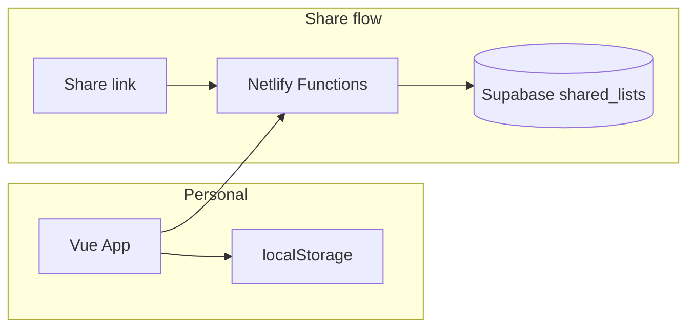

# Architecture

## Overview

The app has two modes:

1. **Personal (default)**  
   Data is stored only in the browser (`localStorage`). No network required after first load. No login.

2. **Shared (optional)**  
   User clicks "Share for 7 days". A snapshot of the current list is sent to the server and stored in Supabase. A secret link is returned. Anyone with the link can view that snapshot until it expires (7 days). Personal data on the device is unchanged.



## Data model

### Local / in-memory shape

Same structure is used in localStorage and in the shared snapshot:

```json
{
  "templateId": "travel",
  "templateName": "Travel Packing List",
  "categories": [
    {
      "id": "cat-docs",
      "name": "Documents",
      "items": [
        { "id": "item-1", "label": "Passport", "checked": false }
      ]
    }
  ]
}
```

- **Category**: `id`, `name`, `items[]`
- **Item**: `id`, `label`, `checked`

### Supabase table: `shared_lists`

| Column       | Type         | Description                          |
| ------------ | ------------ | ------------------------------------ |
| id           | uuid         | Share id (in URL)                    |
| token_hash   | text         | SHA-256 hash of secret token         |
| data         | jsonb        | Packing list snapshot                |
| expires_at   | timestamptz  | When the link becomes invalid (7d)   |
| created_at   | timestamptz  | Creation time                        |
| updated_at   | timestamptz  | Last update                          |

Raw token is never stored; only its hash. Access is validated by `id` + `token_hash`.

## API (Netlify Functions)

Base path: `/.netlify/functions/`

### POST `share-create`

Creates a temporary share.

- **Body**: `{ "data": { "categories": [...], "templateId", "templateName" } }`
- **Returns**: `{ "shareUrl": "https://.../#/shared/<id>?t=<token>", "expiresAt": "ISO date" }`
- **Side effect**: Inserts one row into `shared_lists` with `expires_at = now + 7 days`.

### GET `share-get`

Retrieves a shared list by id and token.

- **Query**: `id`, `t` (token)
- **Returns**: `{ "data": { "categories": [...] }, "expiresAt": "ISO date" }`
- **Errors**: 404 if not found; 410 if `expires_at` has passed.

## Frontend

- **Router**: Hash mode. Routes: `/` (PackingPage), `/shared/:id` (SharedView, token in `?t=`).
- **PackingPage**: Uses `usePackingList()` composable (localStorage read/write). Renders categories and items; "Share for 7 days" calls `share-create` and shows link.
- **SharedView**: Loads data via `share-get`; displays read-only list. Does not write to localStorage.

## Security

- No user accounts. Access to a share is solely via the secret URL (`id` + `t`).
- Token is hashed before storage; validation is done by comparing hash.
- Supabase is accessed only from Netlify Functions using the service role key (never exposed to the client).
