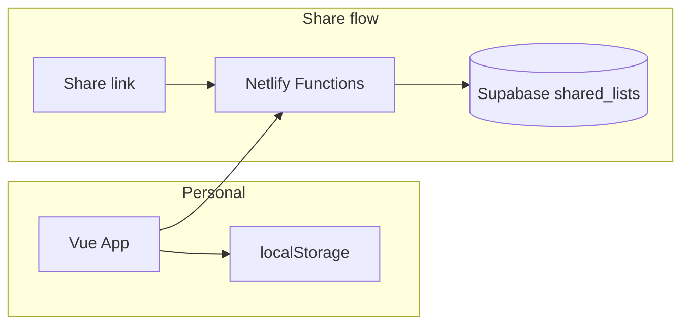

# Architecture

## Overview

The app has two modes:

1. **Personal (default)**  
   Data is stored only in the browser (`localStorage`). No network required after first load. No login.

2. **Shared (optional)**  
   User clicks "Share for 7 days". The first time, a snapshot is sent and a **stable secret link** is returned; the trip is linked to that share (`remoteId`, `remoteToken`). Later shares **update** the same Supabase row so the link always shows the latest version. Anyone with the link can view (and, with true shared editing, both can "save" by sharing again; last-write-wins). Rolling 7-day expiry: each update extends validity.



## Data model

### Local storage: trips

The app stores an array of **trips**. Each trip has:

- `id` – unique id
- `destination` – string (e.g. "Travel to Mecca")
- `date` – ISO date string (e.g. "2026-03-15")
- `categories` – same structure as below
- `remoteId` – optional; Supabase share row id once shared
- `remoteToken` – optional; secret token for that share (never sent to server in clear except in URL/body for API)

The current trip id is stored separately so the UI remembers which trip is selected.

### List shape (per trip / shared snapshot)

Same structure is used per-trip in localStorage and in the shared snapshot:

```json
{
  "destination": "Travel to Mecca",
  "date": "2026-03-15",
  "categories": [
    {
      "id": "cat-docs",
      "name": "Documents",
      "items": [
        { "id": "item-1", "label": "Passport", "checked": true, "quantity": 3 }
      ]
    }
  ]
}
```

- **Category**: `id`, `name`, `items[]`
- **Item**: `id`, `label`, `checked`, `quantity`

### Supabase table: `shared_lists`

| Column       | Type         | Description                          |
| ------------ | ------------ | ------------------------------------ |
| id           | uuid         | Share id (in URL)                    |
| token_hash   | text         | SHA-256 hash of secret token         |
| data         | jsonb        | Packing list snapshot                |
| expires_at   | timestamptz  | When the link becomes invalid (7d)   |
| created_at   | timestamptz  | Creation time                        |
| updated_at   | timestamptz  | Last update                          |

Raw token is never stored; only its hash. Access is validated by `id` + `token_hash`.

## API (Netlify Functions)

Base path: `/.netlify/functions/`

### POST `share-create`

Creates a new share row for the **current trip** (first time sharing that trip).

- **Body**: `{ "data": { "destination": string, "date": string, "categories": [...] } }`
- **Returns**: `{ "shareUrl", "expiresAt", "id", "token" }` – client stores `id` and `token` on the trip as `remoteId` / `remoteToken` for future updates.
- **Side effect**: Inserts one row into `shared_lists` with `expires_at = now + 7 days`.

### POST `share-update`

Updates an existing share row (same link, latest data). Used when the trip already has `remoteId` and `remoteToken`.

- **Body**: `{ "id": "<shareId>", "t": "<token>", "data": { "destination", "date", "categories": [...] } }`
- **Returns**: `{ "expiresAt": "ISO date" }` – rolling TTL: each update sets `expires_at = now + 7 days`.
- **Side effect**: `UPDATE shared_lists SET data = :data, updated_at = now(), expires_at = now() + 7 days WHERE id = :id AND token_hash = sha256(t)`.
- **Errors**: 404 if no row or token mismatch.

### GET `share-get`

Retrieves a shared list by id and token.

- **Query**: `id`, `t` (token)
- **Returns**: `{ "data": { "destination", "date", "categories": [...] }, "expiresAt": "ISO date" }`
- **Errors**: 404 if not found; 410 if `expires_at` has passed.

## Frontend

- **Router**: Hash mode. Routes: `/` (PackingPage), `/shared/:id` (SharedView, token in `?t=`).
- **PackingPage**: Uses `useTrips()` composable (localStorage read/write for multiple trips). For "Share for 7 days": if the current trip has `remoteId`/`remoteToken`, calls `share-update`; otherwise calls `share-create` and stores `id`/`token` on the trip. Share URL is stable per trip.
- **SharedView**: Loads data via `share-get`. **Shared editing enabled**: the list is editable (add/remove categories and items, toggle checkboxes, change quantities). Changes are debounced and pushed to Supabase via `share-update`, so both the share creator and anyone with the link can edit the same list (last-write-wins). Does not use localStorage.

## Security

- No user accounts. Access to a share is solely via the secret URL (`id` + `t`).
- Token is hashed before storage; validation is done by comparing hash.
- Supabase is accessed only from Netlify Functions using the service role key (never exposed to the client).

## Sharing & storage rules

High-level rules for how local storage and Supabase interact:

- **Local-first**: All normal editing (trips, items, quantities, checkboxes) is stored only in `localStorage`. Supabase is used only when:
  - You click **"Share for 7 days"** (create or update), or
  - Someone opens a **shared link**.
- **Stable link per trip**:  
  The first time you share a trip, the app creates a row and stores `remoteId` and `remoteToken` on that trip. The share URL never changes. Later clicks on "Share for 7 days" **update** the same row via `share-update`, so the link always points to the latest saved version.
- **True shared editing (last-write-wins)**:  
  Person 1 and Person 2 both have the same link. Each can edit locally and click Share to push the current snapshot to the server. Whoever saves last wins; the shared view always shows the latest saved snapshot. No real-time sync—edits are published only when Share is clicked.
- **Secret URL access**:  
  Each share is identified by `id` and a secret `token` in the URL (`/#/shared/:id?t=token`). Supabase stores only a hash of the token; without the full URL, a share cannot be fetched or updated.
- **Rolling 7‑day expiry**:  
  Each `share-update` sets `expires_at = now + 7 days`. If no one updates for 7 days, the link expires (HTTP 410). Local trips are unaffected.
- **Editable shared view**:  
  Opening the shared link loads the list and allows full editing (categories, items, checkboxes, quantities). Changes are saved automatically to Supabase via `share-update` (debounced). Both the person who created the share and anyone with the link edit the same row; last-write-wins.
- **No accounts**:  
  There is no authentication; access is controlled entirely by possession of the secret link. Treat share URLs like passwords.
